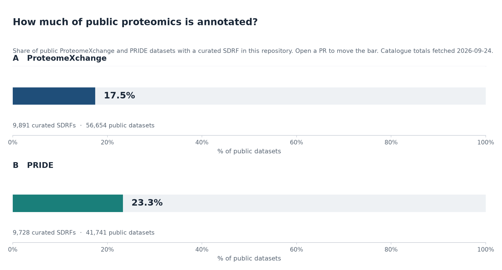
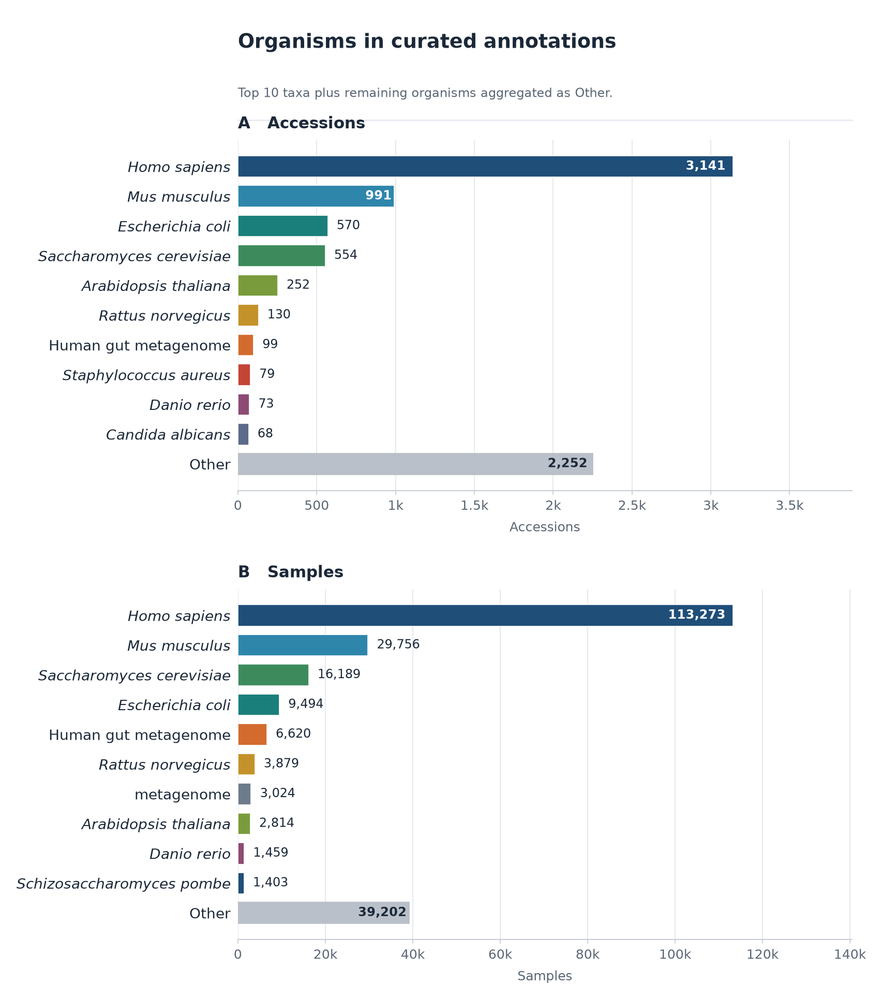
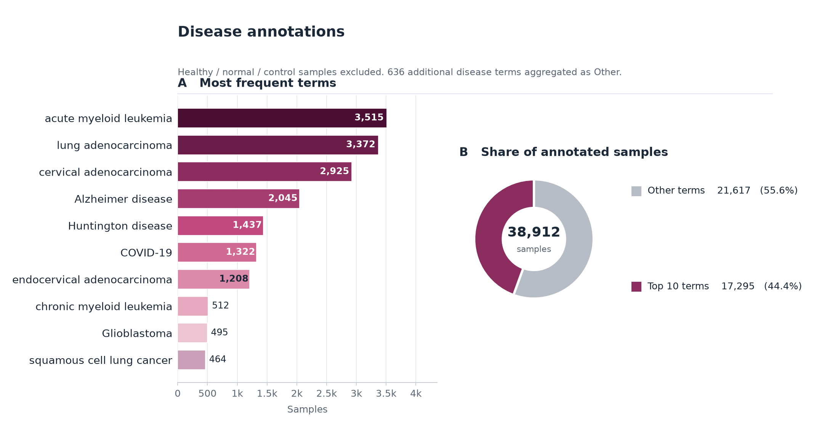
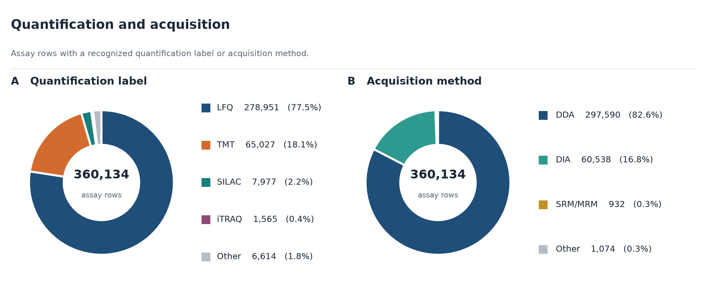
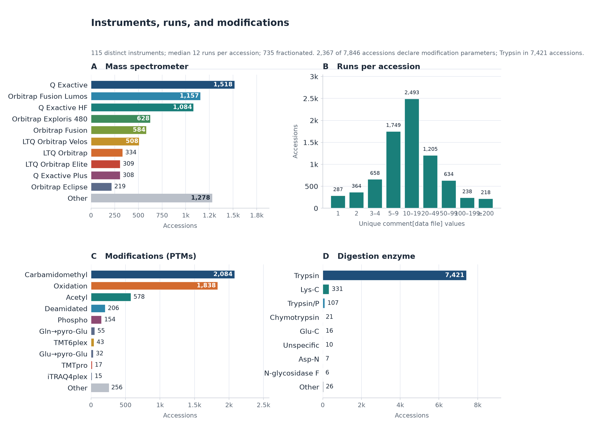
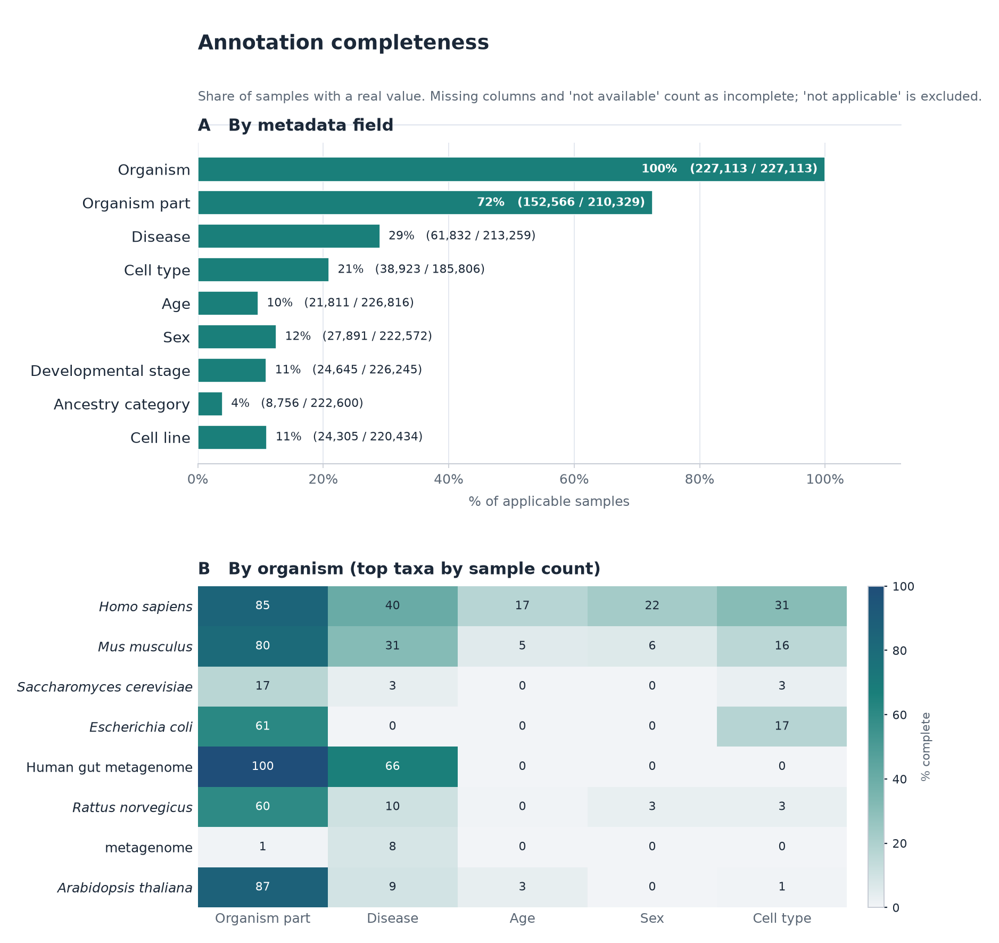
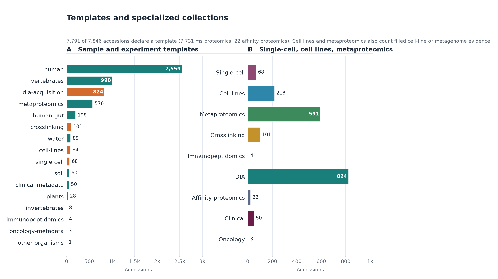
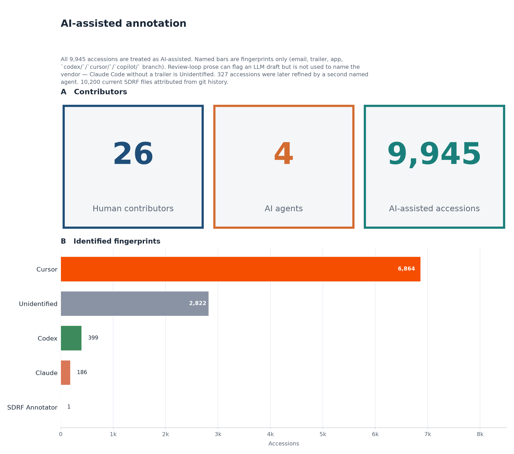

# sdrf-annotated-datasets

[](LICENSE)
[](llms.txt)


[](https://github.com/bigbio/sdrf-annotated-datasets/actions/workflows/validate-sdrf.yml)

Community **SDRF** annotations for public proteomics datasets (ProteomeXchange and related accessions).
The SDRF specification lives in [`bigbio/proteomics-sample-metadata`](https://github.com/bigbio/proteomics-sample-metadata).

**License:** [Apache 2.0](LICENSE) · **Contributing:** [CONTRIBUTING.md](CONTRIBUTING.md) · **Agent context:** [llms.txt](llms.txt), [AGENTS.md](AGENTS.md)

<!-- STATS:START -->
## Resource at a glance

_Auto-generated from curated `datasets/` on 2026-09-24T21:16:48Z. Sandbox drafts are excluded._

| Metric | Count |
| --- | ---: |
| Accessions | 9,945 |
| SDRF files | 10,200 |
| Accessions with a declared template | 9,943 |
| Samples (unique `source name` per file) | 306,449 |
| Runs (unique `comment[data file]` per file) | 411,751 |
| Assay rows | 501,147 |
| Human contributors | 26 |
| AI agents (named fingerprints) | 4 |
| AI-assisted accessions | 9,945 |
| Unidentified agent | 2,822 |
| Multi-agent accessions | 327 |
| Distinct instruments | 150 |
| Median runs per accession | 12 |
| Accessions with modification parameters | 4,389 |
| ProteomeXchange coverage | 9,891 / 56,654 (17.5%) |
| PRIDE coverage | 9,728 / 41,741 (23.3%) |

**Highlights:** most common organism is **Homo sapiens**; **98,575** DIA assay rows; **74,287** TMT and **381,652** LFQ assay rows; **71** single-cell, **528** cell-line, and **594** metaproteomics accessions; sample-field completeness (applicable samples): disease 39%, age 12%; all **9,945** accessions are AI-assisted (**26** human contributors, **4** named AI agents); identified fingerprints are mostly **Cursor**; **2,822** accessions have no vendor fingerprint (typical of Claude Code committed as the reviewer); **399** accessions have Codex evidence (`codex/` PR branches); **327** accessions were touched by more than one agent (most common handoff **Cursor → Codex**); most common instrument is **Q Exactive**; most common modification is **Carbamidomethyl**; **17.5%** of public ProteomeXchange datasets have a curated SDRF here; **23.3%** of PRIDE projects are annotated.

















<!-- STATS:END -->

## Gold standard datasets

Looking for a known-good SDRF to point a pipeline at? A short curated list is kept for
exactly that. Each entry passes both CI gates, maps every row to a real deposited run, and
carries enough sample metadata to exercise what usually breaks first — TMT channel maps,
cell-line identity, phospho-enrichment metadata and factor-value driven designs. Between
them they span five organisms, DDA and DIA, label-free, TMT and SILAC, and 112 to 5,798
rows. The standout is `PXD030304`: 949 cell lines with per-line sex, age, ancestry and
Cellosaurus accession across 5,798 individually mapped runs.

See **[docs/gold-standard-datasets.md](docs/gold-standard-datasets.md)** for the list,
what each one is good for testing, and how to fetch and validate them.

## Known issues

Some deposits have problems that annotation alone cannot fix. Examples are a 2 KB
metadata stub named `.raw`, or a PRIDE instrument field that contradicts the raw file.
These SDRFs are kept, not deleted, and are listed in
**[docs/known-issues.md](docs/known-issues.md)** by severity (critical, major, moderate,
minor), with the evidence for each, so pipelines can skip them and curators can follow up.

## Key links

| Resource | URL |
|---|---|
| Specification | https://github.com/bigbio/proteomics-sample-metadata/blob/master/sdrf-proteomics/README.adoc |
| Public site | https://sdrf.quantms.org/ |
| Templates | https://github.com/bigbio/sdrf-templates |
| Validator CLI (`parse_sdrf`) | https://github.com/bigbio/sdrf-pipelines |
| Agentic toolkit | https://github.com/bigbio/sdrf-skills |

## Dataset layout

Files follow the pattern `datasets/{ACCESSION}/{ACCESSION}.sdrf.tsv`:

```
datasets/PXD000070/PXD000070.sdrf.tsv
datasets/MSV000078494/MSV000078494.sdrf.tsv
```

Additional `.sdrf.tsv` files may appear in the same folder when a project requires split designs.

## Sandbox

Work-in-progress annotations live under [`sandbox/`](sandbox/README.md).
Move a folder to `datasets/` and open a PR once it passes `parse_sdrf validate-sdrf`.
CI only validates `datasets/`; `sandbox/` is exempt so drafts don't block merges.

## Contributing

Open a pull request to add or improve annotated SDRF files.
See [CONTRIBUTING.md](CONTRIBUTING.md) for layout rules and review etiquette.

### Agent-assisted annotation

Use **[sdrf-skills](https://github.com/bigbio/sdrf-skills)** as the primary toolkit.
Key rules:

- **Anchor every row** in public evidence (PX page, submitted metadata, publication). Don't invent sample names or file names.
- **Keep PRs small** — one accession or a closely related batch.
- **Run validation locally** (`parse_sdrf validate-sdrf`) before opening a PR.
- **Declare assistance** in the PR description so reviewers can calibrate review depth.

For agent-specific instructions see [AGENTS.md](AGENTS.md).

### CI validation

GitHub Actions runs `parse_sdrf validate-sdrf` on every PR and push touching `datasets/**`.
The validator is installed from [`bigbio/sdrf-pipelines`](https://github.com/bigbio/sdrf-pipelines) `main` branch.
Re-run all checks manually via `workflow_dispatch` in the Actions tab.

## How to cite

- Dai C, Füllgrabe A, Pfeuffer J, Solovyeva EM, Deng J, Moreno P, Kamatchinathan S, Kundu DJ, George N, Fexova S, Grüning B, Föll MC, Griss J, Vaudel M, Audain E, Locard-Paulet M, Turewicz M, Eisenacher M, Uszkoreit J, Van Den Bossche T, Schwämmle V, Webel H, Schulze S, Bouyssié D, Jayaram S, Duggineni VK, Samaras P, Wilhelm M, Choi M, Wang M, Kohlbacher O, Brazma A, Papatheodorou I, Bandeira N, Deutsch EW, Vizcaíno JA, Bai M, Sachsenberg T, Levitsky LI, Perez-Riverol Y. A proteomics sample metadata representation for multiomics integration and big data analysis. Nat Commun. 2021 Oct 6;12(1):5854. doi: 10.1038/s41467-021-26111-3. PMID: 34615866; PMCID: PMC8494749. [Manuscript](https://www.nature.com/articles/s41467-021-26111-3)
- Perez-Riverol, Yasset, European Bioinformatics Community for Mass Spectrometry. "Towards a sample metadata standard in public proteomics repositories." Journal of Proteome Research (2020) [Manuscript](https://pubs.acs.org/doi/abs/10.1021/acs.jproteome.0c00376).
